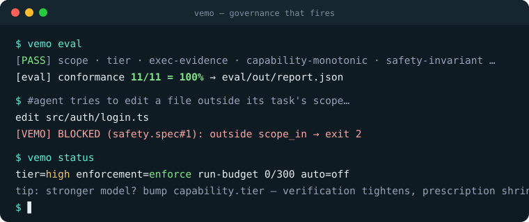
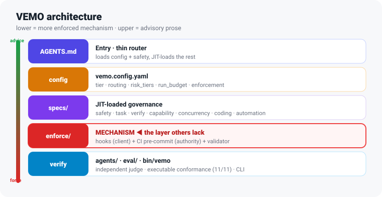

<div align="center">


# VEMO

### Velocity-first · Enforced · Model-aware Orchestration

**Governance for AI coding agents that *accelerates* developers — mechanism over prose, and it *proves* its gates fire.**


[](https://github.com/vemodalen-x/VEMO/stargazers)

[Why](#-why-vemo) · [Quickstart](#-quickstart) · [Architecture](#-architecture) · [CLI](#-the-vemo-cli) · [Docs](#-documentation) · [The name](#-the-name) · [Credits](#-credits)



</div>

---

> **What it is, plainly:** a small set of Markdown specs + thin scripts you drop into any repository. It
> enforces in three rings — agent-loop hooks, git gates, server-side CI — and only the first ring is
> harness-specific (Claude Code wiring ships; any harness with a hook API can reuse the same dispatcher —
> see [docs/ADAPTERS.md](docs/ADAPTERS.md)). The git+CI rings bind **any agent, any model, any harness**.
> **Core dependencies: none** — Markdown + YAML + a little stdlib Python. Model names are advisory routing
> hints; the portable control is `capability.tier`, a behavioral, vendor-neutral rubric
> (`specs/capability.spec.md` §1.5) that maps any LLM family to the same verification and safety gates.
> The governance skills/CLI use the [GitHub CLI](https://cli.github.com/).

## ✨ The name

VEMO is named after **vemödalen** — a word coined by John Koenig in *The Dictionary of Obscure Sorrows*:

> *“the frustration of photographing something amazing when thousands of identical photos already exist — the
> same sunset, the same waterfall — each one a thumbprint in an endless mosaic of indistinguishable snapshots.”*

It's the right name for an era when AI agents generate **oceans of plausible, look-alike, untraceable code**.
VEMO is the layer that makes every change **intentional, verified, and traceable** — so your codebase isn't
just one more indistinguishable snapshot.

And in that same spirit, VEMO is honest about its own originality: it stands on public best practices and its
real contribution is making good, known patterns **mechanical** instead of merely written down. (See [Credits](#-credits).)

## 🤔 Why VEMO

AI coding agents are powerful but **stateless and eager**. Left ungoverned, the failure modes are predictable:

| Problem | Ungoverned | VEMO's answer |
|---|---|---|
| 🔄 Lost context across sessions | repeats work, contradicts past decisions | repo *is* the memory — durable task state in machine-readable front-matter |
| ⚡ Two sessions edit the same file | silent clobber | `chat_id` + heartbeat + takeover protocol (and a CI ownership check) |
| 🚫 Ships unverified | "looks done" merges | acceptance gates + an **independent judge** on critical work |
| 📉 Rule drift | rules live only in someone's head | rules live in the repo; the critical ones are **enforced by hooks/CI** |
| 🏃 Runaway autonomy | a long-horizon model "runs until cut off" | **run-budget stop rules** — hard-stop when unattended |

The thread: **the rules that matter are mechanism, not hope.** A "hard gate" written only as prose is a gate
that fails the moment the model doesn't read it.

## 🚀 What you get — five shifts

| # | Most frameworks | VEMO |
|---|---|---|
| 1 | Gates are **prose** the model may ignore | **Mechanically enforced** (hooks + CI backstop) — they can't be argued with |
| 2 | **Front-load** every spec each session | **Just-in-time** loading — only the specs a task needs |
| 3 | **One** ceremony level for everything | **Risk-tiered**: R0 fast · R1 standard · R2 critical |
| 4 | Ceremony is a **constant** | **Scales with your model** (`capability.tier`: frontier→low) |
| 5 | Agent **self-reports** "done" | An **independent judge** verifies high-risk gates |

## ⚡ Quickstart

```bash
# 1) drop VEMO into your repo
cp -r VEMO/{AGENTS.md,vemo.config.yaml,specs,enforcement,agents,tasks,bin,presets} your-repo/ && cd your-repo

# 2) one command — installs hooks + git pre-commit/pre-push, preconfigures build/test for your stack
python3 bin/vemo init --preset python        # or: node | cpp | docs   (--dry-run to preview)
# Windows: use `python bin/vemo ...` if `python3` is not installed.
export PATH="$PWD/bin:$PATH"                  # so you can just type `vemo`

# 3) make it AUTHORITATIVE: server-side CI + branch protection (local hooks are fast feedback only)
mkdir -p .github/workflows && cp enforcement/ci/vemo-ci.yml .github/workflows/

# 4) start a task, set its scope, then code — out-of-scope edits are now blocked automatically
cp tasks/_TASK_TEMPLATE.md tasks/T-myfeature.md   # set  scope_in: ["src/feature/**"]  risk: R1
vemo status                                       # where am I?    vemo explain gates
```

**The "aha":** ask your agent to edit a file outside `scope_in` — the hook blocks it. You didn't have to police it.

▶ Full walkthrough: **[docs/QUICKSTART.md](docs/QUICKSTART.md)** · the model in 5 ideas: **[docs/MENTAL_MODEL.md](docs/MENTAL_MODEL.md)** · 🖼️ visual guide + diagrams: **[docs/GUIDE.html](docs/GUIDE.html)**

## 🧭 Architecture

Five layers — the lower you go, the more it's *enforced mechanism* rather than *advisory prose*:

<p align="center"></p>

```
┌ AGENTS.md ───────────── thin router: loads config + safety, then JIT-loads the rest   (prose)
├ vemo.config.yaml ────── config where EVERY key has a consumer (selfcheck-enforced)     (config)
├ specs/ ──────────────── safety · task · verify · concurrency · coding · automation     (prose, JIT)
├ enforcement/ ────────── ⛨ hook dispatcher + git pre-commit/pre-push + CI workflow  ◀── MECHANISM
└ agents/ · eval/ · bin/  governance-judge · validator+hook e2e eval · the `vemo` CLI    (verify · tooling)
```

Enforcement is **defense-in-depth** — a gate never depends on the agent's goodwill, and every
"passed" claim needs an artifact the claimant did not type (evidence file · `vemo verify` receipt ·
required judge provenance record(s)):

```
agent → ⛨ PreToolUse hook → action runs → ⛨ git pre-commit → ⛨ git pre-push → ⛨ CI workflow → ✓ main
         scope·blob·cmd·secret·budget       scope·tier·judge    acceptance·receipt   same checks, server-side
         (fast, client-side)                (no self-downgrade)  ·judge provenance   (authoritative with branch
                                                                                      protection; --no-verify moot)
```

🖼️ **Rich, color diagrams** (layered stack, request lifecycle, the two-walls pipeline, and a risk×capability
ceremony matrix) are in **[docs/GUIDE.html](docs/GUIDE.html)**.

## 🔧 The `vemo` CLI

One verb-based entry point (run `vemo` for the map, `vemo explain <topic>` to learn a concept in one line):

| Command | Does |
|---|---|
| `vemo init [--preset python\|node\|cpp\|docs]` | set up VEMO in this repo (preset + hooks + git gates + tasks/) |
| `vemo status` | plain-language dashboard: mode · tier · enforcement · budget · auto mode · active task |
| `vemo context` | machine-read session brief (≤20 lines: task · gates · budget · rules) — read this, not the raw config |
| `vemo verify` | **execute** `paths.build/smoke` → evidence log + machine receipt (what the push gate trusts) |
| `vemo doctor` | health check (config, hooks, tools, stale tasks, gates-heartbeat) |
| `vemo selfcheck` | internal consistency: ENFORCED-BY claims and config keys must map to real consumers |
| `vemo eval` | executable conformance harness, validator + hook end-to-end (writes `eval/out/report.json`) |
| `vemo judge-brief [--lens <l>]` | evidence dossier for a judge pass (claims · gates · receipt · changes + lens checklist) |
| `vemo heartbeat` | stamp the active task's heartbeat in place (no hand-editing the task file) |
| `vemo explain <topic>` | `tiers · gates · auto · budget · judge · capability · presets · verify` |
| `vemo auto on\|off\|status` | unattended mode — `on` requires a human at a TTY; records every decision |
| `vemo budget status\|reset` | run-budget / stop rules |
| `vemo tier <paths…>` / `vemo check <path>` | required risk tier / is a path in scope? |
| `vemo fleet <command>` | PC-wide inventory, profiles, readiness reports, preview-first onboarding, audit verification |
| `vemo skill-score` / `vemo skill-audit` | quality bar for VEMO's own skills (frontmatter / naming / catalog parity) / catalog-vs-disk consistency audit |

### One PC, many projects

Install a user-local launcher once, discover Git projects without changing them, then opt projects into a policy
profile explicitly:

```powershell
python bin\vemo fleet install
python bin\vemo fleet install --apply
vemo fleet discover C:\Users\User\Documents --max-depth 6
vemo fleet register C:\work\product-a --profile solo
vemo fleet status --json
vemo fleet onboard C:\work\product-a --profile solo  # dry-run; add --skills-root and --apply only by consent
```

Fleet is local-first: its registry and hash-chained audit log stay under `VEMO_HOME`; discovery and status are
read-only; onboarding refuses dirty worktrees and project-owned conflicts. See [docs/FLEET.md](docs/FLEET.md) for the
operating model and [docs/STANDARDS.md](docs/STANDARDS.md) for the NIST SSDF/CSF, SLSA, OWASP, and OpenSSF mapping.

## 🧩 Skills

Reusable, script-backed procedures the agent auto-invokes by their frontmatter `description` (catalog: [skill/_catalog.md](skill/_catalog.md)):

| Skill | For |
|---|---|
| `call-graph` | who-calls / what-calls / chains / impact (tool-backed: `cg.py`) |
| `flow-discovery` | generate a flow doc from real call chains |
| `docs-sync` | keep README / GUIDE / docs in sync |
| `governance-sync` · `-contribute` · `-release` | pull upstream updates · PR improvements back · cut a release |
| `automation-mode` | enter full-auto (unattended) mode |
| `hackathon-submission` | pre-submission readiness check against a contest's own rules |

> Skills are intentionally thin: contracts stay readable, deterministic work lives in scripts, and release-time
> documentation updates are routed through `docs-sync`.

## 📚 Documentation

Organized by need ([Diátaxis](https://diataxis.fr/)): **learn → do → look-up → understand.**

| I want to… | Go to |
|---|---|
| See the whole picture (usage + architecture diagrams) | 🖼️ [docs/GUIDE.html](docs/GUIDE.html) |
| Get working in 5 minutes | [docs/QUICKSTART.md](docs/QUICKSTART.md) |
| Migrate an existing agent playbook into VEMO | [docs/PLAYBOOK_ADOPTION.md](docs/PLAYBOOK_ADOPTION.md) |
| Run a Devpost-style hackathon build under a deadline (Codex adapter incl.) | [docs/HACKATHON_PLAYBOOK.md](docs/HACKATHON_PLAYBOOK.md) |
| Design diagnostic coaching/tutoring agent flows | [docs/DIAGNOSTIC_PROMPTING.md](docs/DIAGNOSTIC_PROMPTING.md) |
| Govern every Git project on one PC | [docs/FLEET.md](docs/FLEET.md) |
| Understand standards and commercial readiness mapping | [docs/STANDARDS.md](docs/STANDARDS.md) |
| Understand how VEMO thinks | [docs/MENTAL_MODEL.md](docs/MENTAL_MODEL.md) |
| Find the right doc fast | [docs/INDEX.md](docs/INDEX.md) |
| Threat model · roadmap | [SECURITY.md](SECURITY.md) · [ROADMAP.md](ROADMAP.md) |
| Look up config / changes | [vemo.config.yaml](vemo.config.yaml) · [CHANGELOG.md](CHANGELOG.md) |

## 🌱 Credits

VEMO combines public patterns from agent governance, spec-driven development, documentation architecture, and
long-horizon model safety. It openly credits the best practices it stands on:

- **[GitHub Spec Kit](https://github.com/github/spec-kit)** — `init` + preset ergonomics, spec-driven workflow.
- **[12-Factor Agents](https://github.com/humanlayer/12-factor-agents)** — own-your-context, stateless reducer.
- **[AGENTS.md](https://agents.md/)** + Anthropic's *context engineering* — thin, just-in-time entry.
- **[Diátaxis](https://diataxis.fr/)** — docs organized by user need.
- Fable 5 / Mythos analysis (2026) — the run-budget stop rules and the evidence-completeness judge check.

> See [docs/SCALING.md](docs/SCALING.md) for why VEMO holds up — and gets *more* useful — as models get stronger.

## 🤝 Contributing

PRs welcome. VEMO **governs itself** — changes flow through its own task lifecycle, and the same hooks/CI that
protect consumers protect this repo. See **[CONTRIBUTING.md](CONTRIBUTING.md)**. Good first contributions:
a new `presets/<stack>.yaml`, a new `eval/` scenario, or a Windows hook runner.

## ⭐ Star history

<a href="https://star-history.com/#vemodalen-x/VEMO&Date"></a>

If a governance framework that *proves* it works (and tells you where it doesn't) is what you've been missing — a ⭐ helps others find it.

## 📄 License

[MIT](LICENSE) © 2026 The VEMO Authors.

## ⚠️ Status

**Status.** VEMO is a framework of specs + thin scripts; treat it as a starting skeleton you tune via
`vemo.config.yaml`. Model names referenced in defaults (Opus 4.8, Fable 5, Mythos) are examples, not trust
anchors. Swap them freely; keep `capability.tier` calibrated to observed model behavior.

<div align="center"><sub>governance that gets out of your way — until it shouldn't.</sub></div>
